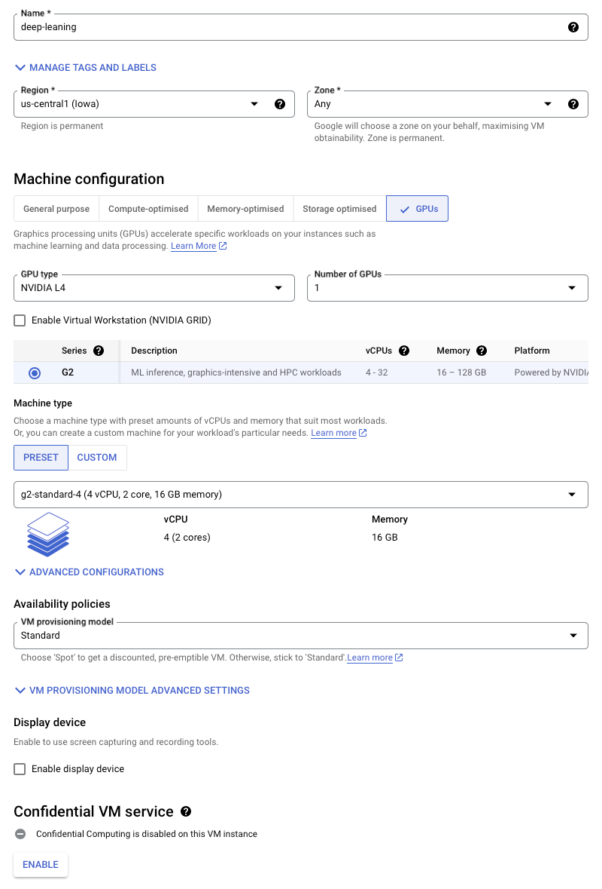
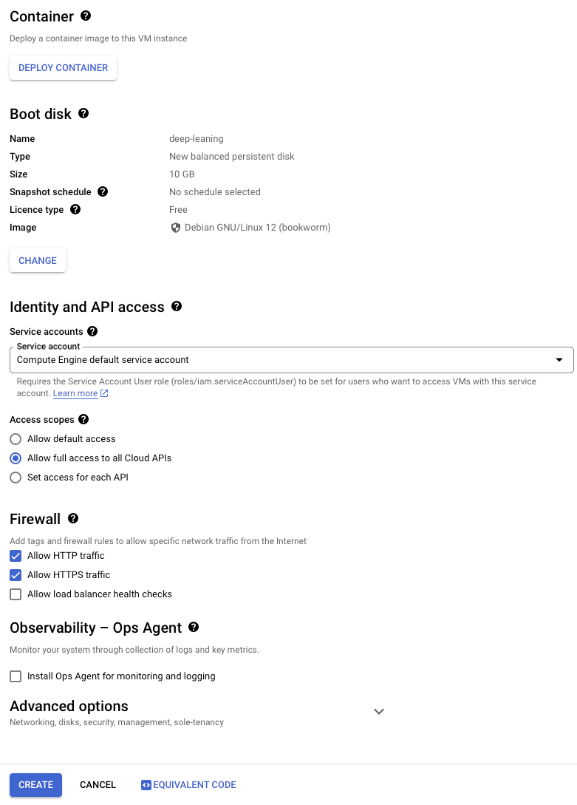

# Deep Learning Monitoring
 
## Introduction

This project is designed to provide comprehensive visualization of server utilization during deep learning model training. By leveraging this tool, users can gain real-time insights into the performance and resource usage of their virtual machines, including detailed GPU metrics. This system is highly versatile and can be deployed across a range of environments, including personal computers, dedicated servers, and large-scale datacenters.

### Key Features:

1. Real-Time Monitoring: Track and visualize every critical aspect of the virtual machine, including CPU, memory, disk I/O, and GPU utilization, in real-time.

2. Deep Learning Optimization: Specifically tailored for monitoring environments where deep learning models are being trained, offering precise insights into GPU performance, memory usage, and processing speed.

3. Scalable Deployment: The tool can be easily deployed on various platforms, from personal computers to enterprise-level datacenters, making it ideal for both individual developers and large teams.

4. Google Cloud Platform Integration: Utilizes Google Cloud Platform (GCP) to spin up and manage virtual machines, ensuring robust and scalable infrastructure for monitoring.

5. Comprehensive Toolset: Includes installation and configuration of essential monitoring tools like DCGM, Prometheus, and nvidia_smi_exporter to capture and display GPU metrics alongside other system metrics.

6. Customizable Dashboards: Offers customizable Grafana dashboards that allow users to filter and drill down into specific metrics, providing a tailored view based on individual needs.

7. Cross-Platform Compatibility: Compatible with various operating systems and environments, ensuring flexibility in deployment and usage.

### Applications:

This monitoring tool is ideal for:

1. Researchers and developers working on deep learning models who need to monitor and optimize resource usage.

2. IT administrators managing server infrastructure in datacenters or cloud environments.

3. Educational institutions and research labs requiring detailed insights into computational resource allocation.

### Deployment Scenarios:

1. Personal Computers: Developers can deploy the monitoring system on their local machines to track resource usage during model training.

2. Servers: IT teams can use this tool to manage and optimize server performance, ensuring efficient utilization of resources.

3. Datacenters: Large-scale deployments in datacenters can benefit from the system's scalability and detailed monitoring capabilities, helping to maintain high performance and resource efficiency.

By implementing this monitoring system, users can achieve greater transparency and control over their computational resources, ultimately leading to more efficient deep learning model training and better resource management.

## Setting Up

### Prerequisites & Tech-stacks

- Google Cloud Platform
- Debian Linux
- CUDA - 12.1
- Python
- Tensorflow
- PyTorch
- Docker
- Prometheus
- Grafana
- Node Exporter
- DCGM Exporter
- Nvidia SMI Exporter


All the above mentioned packages will be availabe under [prerequisites](#prerequisites--tech-stacks).

### Environment Setup

I am assuming you already have a GCP account, if you want to follow my approach. Firstly I will be creating a virtual machine with 4 core, 16 GB memory with debian based deep learning image. The image will automatically install PyTorch - 2.3, CUDA - 12.1, Fast AI, Python - 3.10.
I will be selecting a 150 Gigs of storage. I will be enabling the HTTP and HTTPS networks for the firewall rules.

For this project I am selecting one L4 GPU. You are free to selecting any number of GPUs of differnt kinds (A100s, H100s, etc). 





Inorder to run the project on your local environment, the prerequisites needs to be met for a seamless running. The setup followed the steps below:

1. Cloning The Repository
You can down the entire repository using the below command

```sh
git clone https://gitlab.orc.gmu.edu/Abhinav/os_tickets_analysis.git
```

2. Creating Virutal Environment

    1. Firstly, create a virutal environment in python. You can refer to the below script for the same.
    2. Replace <your_virtual_environment_name> with an unique name.
    3. Activate the virtual environment using the next command


```sh
python3 -m venv <your_virtual_environment_name>
``` 

```sh
source <your_virtual_environment_name>/bin/activate
``` 

3. Installing the required prerequisites
Once you are inside the virutal environment, you can install all the dependencies according to the versions using the below command.

```sh
pip3 install requirements.txt
```

4. Installing MySQL server
You can setup the MySQL database on your local machine by downloading [MySQL] (https://www.mysql.com)

5. Exporting & Importing the database
The ORC OSTickets database had been exported from the orgin server and imported into the local MySQL server. It is necessary to log into the osticket server to run the dump command then transfer the database out.

```sh
mysqldump -u username -p database_name > sqldumpfilename.sql

```

We create a new database in the local server using the databse dump.

```sh
mysql -u username -p database_name < sqldumpfilename.sql

```

Once all this is set up, it should now be possible to retrieve the data.

> **NOTE** 
> The database name should match the origin server.


### Reteriving the Data

1. #### Connection to MySQL instance

    By using the MySQL connector, the python will establish a connection to the mysql database. I had implemented a query to innerjoin three tables to reterive Name, User ID, Tickets Created and performing the data handling for further processing.

```python
import mysql.connector as connection
import pandas as pd
try:
    mydb = connection.connect(host="localhost", database ="osticket",user="root", passwd="root@123",use_pure=True)
    query = "select ost_user.name, ost_user_email.address, ost_ticket.* from ost_user inner join ost_user_email on ost_user_email.id = ost_user.id inner join ost_ticket on ost_user.id = ost_ticket.user_id;"
    result_dataFrame = pd.read_sql(query,mydb)
    result_dataFrame = result_dataFrame.rename(columns = {'name':'Name', 'address':'User_ID'})
    result_dataFrame['User_ID'] = result_dataFrame['User_ID'].str.replace('@gmu.edu','')
    result_dataFrame['User_ID'] = result_dataFrame['User_ID'].str.replace('@GMU.EDU','')
    result_dataFrame['User_ID'] = result_dataFrame['User_ID'].str.replace('@GMU.edu','')
    result_dataFrame['User_ID'] = result_dataFrame['User_ID'].str.replace('@masonlive.gmu.edu','')
    mydb.close() #close the connection
except Exception as e:
    mydb.close()
    print(str(e))

```

2. #### Retreiving the Users & Departments Data From Slurm

    The below script will dump all the users and department into a new file. The data from the text file is then converted into a dataframe, as shown in the code snippets below.

```sh
for user in $(sacctmgr show users --noheader |  awk '{print $1}');
    do 
        org=$(sacctmgr show account $(sacctmgr show user $user --noheader | tail -n1 | awk '{print $2}') --noheader format=org);
        echo $user $org;
    done

done >> user_org.txt&

```

```python
f = open('user_organization.txt','r')
uID = []
dID = []

for i in f:
    uID.append(i.split()[0])
    dID.append(i.split()[-1])

department = pd.DataFrame({'User_ID':uID, 'Department':dID})
department

```

The final table, below, will give the User ID along with the Department name associated with the User ID.

| User_ID  | Department |
| :------- | :--------: |
| aabramow | aoes       |
| aabutale | ggs        |
| aachar5  | aeos       |
| aachary  | cs         |
| ........ | .......... |
| zwang52  | cyse       |
| zwu24    | ist        |
| zxu27    | stat       |
| zzhu22   | cs         |


3. #### Data Handling

Once all the data is converted to the required columns and into an appropriate format, we filter it down to the time period between 2021- 2024 which is what we focus on in our analyses. The original data contains records from as far back as 2018, before the Hopper cluster was commissioned. This is done with the code snippets as show below.

```python
last3Years = result_dataFrame.copy()
last3Years['created'] = pd.to_datetime(last3Years['created']).dt.strftime('%Y-%m')
last3Years['created_year'] = pd.to_datetime(last3Years['created']).dt.strftime('%Y')
# last3Years['created_year'] = last3Years['created_year'].astype(int)
last3Years = last3Years.loc[last3Years['created_year'].astype(int).isin([2021,2022,2023,2024])]
last3Years.sort_values('created_year', ascending = False, inplace = True)

```

## Ticket Trends

### Ticket Created

#### By Users
    
To organize the data by the user IDs, we needed to merge the data obtained from the database with information from the Slurm database on the corresponding user accounts. Any duplicates were dropped and the resulting cleaner data was merged with the departments data reterived from the Slurm database. We made sure to exclude automatic replys and form submissions for account creation.

```python
ticketsCreated = last3Years.copy()
ticketsCreated = ticketsCreated.groupby(['Name','User_ID']).count().reset_index().rename(columns = {'ticket_id':'Tickets Created'})[['Name', 'User_ID', 'Tickets Created']].sort_values('Tickets Created', ascending = False).reset_index(drop = True)
ticketsCreated = ticketsCreated.drop_duplicates(subset = 'User_ID')
ticketsCreated = pd.merge(ticketsCreated,department,on='User_ID', how = 'left')
ticketsCreated = ticketsCreated.drop_duplicates(subset = 'User_ID')
ticketsCreated = ticketsCreated.reset_index(drop = True)
ticketsCreated = ticketsCreated.drop([3,15]) # Removign the noreply & Forms
# with pd.option_context('display.max_rows', None,
#                        'display.max_columns', None,
#                        'display.precision', 3,
#                        ):
#     print(ticketsCreated)
ticketsCreated

```

The table below gives the details for the users and how many tickets they had created along with the department name.

| Name               | User ID  | Tickets Created | Department |
| :----------------- | :------: | :-------------: | :--------: |
| Ylenia Chiari      | ychiari  | 104             | biol       |
| Shinkuang Chang    | schang31 | 91              | aoes       |
| Marie Smirman      | msmirman | 69              | phys       |
| Samuel Blouir      | sblouir  | 49              | sblouir    |
|     ...            |    ...   |        ...      |    ...     |  
| Fariya Zahed       | fzahed   | 1               | daen       |
| Pooja Lavu         | plavu    | 1               | cs         |
| Pooya Fayyazsanavi | pfayyazs | 1               | cs         |
| Falah Amro         | famro    | 1               | ist        |
| Sai Allanki        | sallanki | 1               | cs-instr   |

The same information is illustrated in this plot below, which gives the User ID (on Y-axis) and Number of tickets created (on X-axis) by each user.


> **Insights**
>    - Ylenia Chiari stands tops in tickets creation from 2021 to 2024.
>    - Total Number of accounts on the cluster - 1743

#### By Department

Next, we query the data with respect to the number of tickets submitted departmentwise. We do this, as before, for tickets created between 2021 to 2024 across all the departments. This is done with the code section below.


```python
departmentWise = last3Years.copy()
departmentWise = pd.merge(departmentWise,department,on='User_ID', how = 'left')
departmentWise['Department'].fillna('Unknown', inplace = True)
departmentWise = departmentWise.groupby('Department').count().reset_index()[['Department','Name']]
departmentWise = departmentWise.rename(columns = {'Name':'Tickets Created'})
departmentWise = departmentWise.sort_values(by = 'Tickets Created', ascending = False).reset_index(drop = True)
departmentWise = departmentWise[1:]
departmentWise[:5]

```

The resulting table, shown below, gives the total number of tickets received based on the department for the top departments.

| Department | Tickets Created |
| :--------: | :-------------: | 
| cs         | 726             |
| aoes       | 573             |
| phys       | 317             |
| cs-instr   | 312             |
| ceie       | 300             |
| chem       | 246             |
| ece        | 207             |
| ist        | 193             |
| biol       | 183             |
| daen       | 167             |

The following plot provides a graphical repesentation of the number of tickets created by each and every department.


The same data, illustrated differently in a word-cloud format to show the clusters of departments/users submitting tickets, is presented in the plot below.


> **Insights**
>    - CS tops in the ticket creation by 726.
>    - AOES stands next.
>    - CS has the drastic majority when compared to the different departments.

#### By School

Here, we will be digging deeper to visualize the ticket insights created by each and every school

#### CEC - College of Engineering and Computing

```python
cec = schoolWise[schoolWise['Department'].isin(['cs','cs-instr','ist-instr','ist','stat', 'cyse', 'seor', 'ece', 'me', 'ceie', 'beng', 'daen', 'ece-instr'])]

```
The resulting table, shown below, gives the total number of tickets created by the college of engineering and computing.

| Department | Tickets Created |
| :--------: | :-------------: | 
| cs         | 726             |
| cs-instr   | 312             |
| ceie       | 300             |
| ece        | 207             |
| ist        | 193             |
| daen       | 167             |
| beng       | 165             |
| stat       | 134             |
| ece-instr  | 88              |
| seor       | 60              |
| me         | 40              |
| cyse       | 25              |
| ist-instr  | 5               |

The following plot provides a graphical repesentation of the number of tickets created by CEC.


#### COS - College of Science

```python
cos = schoolWise[schoolWise['Department'].isin(['aoes', 'biol', 'chem', 'cds', 'esp', 'frsc', 'ggs', 'ipn', 'math', 'phys', 'ssb', 'cds-instr'])]

```
The resulting table, shown below, gives the total number of tickets created by the college of science.

| Department | Tickets Created |
| :--------: | :-------------: | 
| aoes       | 573             |
| phys       | 317             |
| chem       | 246             |
| biol       | 183             |
| ggs        | 93              |
| cds        | 89              |
| esp        | 70              |
| math       | 68              |
| ssb        | 38              |
| ipn        | 23              |
| cds-instr  | 7               |
| frsc       | 1               |


The following plot provides a graphical repesentation of the number of tickets created by COS.


#### CHSS - College of Humanities and Social Sciences

```python
chss = schoolWise[schoolWise['Department'].isin(['cls', 'econ', 'psyc','soan','arth','eln'])]

```
The resulting table, shown below, gives the total number of tickets created by the college of humanities and social sciences.

| Department | Tickets Created |
| :--------: | :-------------: | 
| psyc       | 125             |
| eln        | 30              |
| econ       | 24              |
| arth       | 7               |
| soan       | 6               |
| cls        | 6               |


The following plot provides a graphical repesentation of the number of tickets created by CHSS.


#### CEHD - College of Education and Human Development

```python
cehd = schoolWise[schoolWise['Department'].isin(['soed', 'hap'])]

```
The resulting table, shown below, gives the total number of tickets created by the college of education and human development.

| Department | Tickets Created |
| :--------: | :-------------: | 
| soed       | 22              |
| hap        | 4               |


The following plot provides a graphical repesentation of the number of tickets created by CEHD.


#### Others Schools & Departments

```python
misc = schoolWise[schoolWise['Department'].isin(['gch', 'law', 'som'])]

```
The resulting table, shown below, gives the total number of tickets created by other schools.

| Department | Tickets Created |
| :--------: | :-------------: | 
| som        | 89              |
| law        | 21              |
| gch        | 10              |


The following plot provides a graphical repesentation of the number of tickets created by other schools.


#### Tickets Created Monthly

Next, we reterive the number of tickets created by the users every month from 2021 to 2024.

```python
monthlyTimeSeries = last3Years.copy()
monthlyTimeSeries['created'] = pd.to_datetime(monthlyTimeSeries['created']).dt.strftime('%Y-%m')
monthlyTimeSeries = monthlyTimeSeries.groupby('created').count().sort_values('created', ascending = True).reset_index()
monthlyTimeSeries = monthlyTimeSeries[['created','ticket_id']]
monthlyTimeSeries = monthlyTimeSeries.rename(columns = {'ticket_id':'count'})
# with pd.option_context('display.max_rows', None,
#                        'display.max_columns', None,
#                        'display.precision', 3,
#                        ):
#     print(monthlyTimeSeries)
monthlyTimeSeries[:5]

```

This table gives the ticket creation dates along with the total count for the tickets submitted on the same date.

| Created | Count |
| :-----: | :---: |
| 2021-01 |  73   |
| 2021-02 |  70   |
| 2021-03 |  109  |
|   ...   |  ...  |
| 2024-03 | 125   |
| 2024-04 | 134   |
| 2024-05 | 118   |

Below is a stacked line chart providing the trends on number of tickets created monthly.


In the line chart below, visualizing the trends shows us that month-to-month, and year-to-year, we have been seeing a stedy increase in the numberof tickets being submitted.


> **Insights**
>   - There is the expected peak in the number of tickets being submitted both in the beginning of the Spring semester (February) and Fall semester (September) periods. 
>   - The number of tickets being submitted has been increasing as the cluster expands and utiliaztion increases over the years


> **_NOTE_**:_The last database dump was done in early May which is why the 2024 numbers flatten out._

## Ticket Resolution

#### Ticket Classification

The tickets received in the OSTicket system can be classified based on priority as either Low, Normal or High. This is usually done by the originator of the ticket, and the priority level can be changed later on. To retrieve the number of tickets created based on priority level, we use the script below.

```python
ticketsHierarchy = pd.merge(last3Years, output_dataFrame,on='ticket_id', how = 'left')
ticketsHierarchy['priority'] = ticketsHierarchy['priority'].replace('1','Low')
ticketsHierarchy['priority'] = ticketsHierarchy['priority'].replace('2','Normal')
ticketsHierarchy['priority'] = ticketsHierarchy['priority'].replace('3','High')
ticketsHierarchy['priority'] = ticketsHierarchy['priority'].replace('4','Emergency')
ticketsHierarchy = ticketsHierarchy[['priority','Name']].groupby('priority').count().reset_index()
ticketsHierarchy = ticketsHierarchy.rename(columns = {'Name':'Count', 'priority':'Priority'})
ticketsHierarchy

```
This gives us the below table which gives the number of tickets created with High, Low and Normal priority.

| Status_ID | Count |
| :-------- | :---: |
| High      | 57    |
| Low       | 3     |
| Normal    | 5898  |

The pie chart belowis a visual representation of the number of tickets created based on each priority level.


> **Insights**
>  - A large number of the tickets created are tagged normal-priority.  


#### Time Taken For Ticket Resolution

After extracting the ticket categorization, we look at details on the time to ticket response times based on the priority level. For this case, we looked specifically at when the tickets were last updated in lieu of actual closing dates since this was a better representation of the ticket activity. 

```python
openClosed = last3Years.copy()
openClosed['created'] = pd.to_datetime(openClosed['created'])
openClosed['lastupdate'] = pd.to_datetime(openClosed['lastupdate'])
openClosed['time_taken'] = openClosed.lastupdate - openClosed.created
openClosed['status_id'] = openClosed['status_id'].replace(1,'Low')
openClosed['status_id'] = openClosed['status_id'].replace(2,'Normal')
openClosed['status_id'] = openClosed['status_id'].replace(3,'High')
openClosed['status_id'] = openClosed['status_id'].replace(4,'Emergency')
openClosed = openClosed[['status_id', 'time_taken']]
openClosed.tail(40)

```

The below table will give the ticket priority level along with the time taken to resolve the ticket.

| Status_ID | Time_taken      |
| :-------- | :-------------: |
| Normal    | 0 days 17:50:49 |
| Normal    | 1 days 00:55:00 |
| Normal    | 1 days 23:58:49 |
|  ...      |  ...            |
| Normal    | 0 days 12:22:51 |
| Normal    | 0 days 01:41:43 |
| Normal    | 0 days 00:05:00 |

A box plot visual representation providing the priority level and the time taken to resolve the ticket.


> **Insights**
> The high priority tickets took a longer time to resolve, likely because they presented more complex questions compared to the normal and low priority tickets. In the next section, the average times to resolution are looked at.
    

#### Average Time Taken For Ticket Resolution Based On Priority

To get a better understanding of the resolution time for the tickets based on the priority level, we looked at the average time taken using the script below

```python
avgTime = openClosed.groupby('status_id').mean()
avgTime = avgTime.reset_index()
avgTime

```

The below table provides the average time taken per ticket based on priority level.

| Status_ID | Average_Time_Taken         |
| :-------- | :------------------------: |
| High      | 28 days 23:32:45.620393974 |
| Low       | 107 days 04:10:52.989280245|
| Normal    | 52 days 06:05:30.239864865 |

The bar plot will give you priority based average time taken for the resolution.


> **Insights**
>
>  The high priority tickets take longest to resolve, likely due to increased complexity as discussed in the previous section.


We also retrieve the average time taken to closure for every user,illustrate the time to closure for tickets and look at who are submitting high priority tickets in the next 3 sections.

#### Time to Closure - Days

The number of tickets resolved within different time spans:

```python
uSatisfication[['avg_time_taken']][(uSatisfication['avg_time_taken'] == 0)].count()
uSatisfication[['avg_time_taken']][(uSatisfication['avg_time_taken'] > 0) & (uSatisfication['avg_time_taken'] < 5)].count()
uSatisfication[['avg_time_taken']][(uSatisfication['avg_time_taken'] > 5) & (uSatisfication['avg_time_taken'] < 10)].count()
uSatisfication[['avg_time_taken']][(uSatisfication['avg_time_taken'] > 10) & (uSatisfication['avg_time_taken'] < 15)].count()
uSatisfication[['avg_time_taken']][(uSatisfication['avg_time_taken'] > 20) & (uSatisfication['avg_time_taken'] < 30)].count()
uSatisfication[['avg_time_taken']][(uSatisfication['avg_time_taken'] > 30) & (uSatisfication['avg_time_taken'] < 60)].count()
uSatisfication[['avg_time_taken']][(uSatisfication['avg_time_taken'] > 60) & (uSatisfication['avg_time_taken'] < 500)].count()

```

The number of tickets resolved within the number of days.

| Tickets Closed Within (days) | Number of Tickets |
| :--------------------------- | :---------------: |
| 0 Days                       | 14                |
| 0 to 5 Days                  | 81                |
| 5 to 10 Days                 | 142               |
| 10 to 15 Days                | 165               |
| 20 to 30 Days                | 436               |
| 30 to 60 Days                | 254               |
| 60 to 500 Days               | 304               |

The bar plot gives number of tickets resolved within specific number of days.


> **Insights**
>
>  A good number of tickets are normally within 30 days. 

#### Time to Closure


```python
uSatisfication = last3Years.copy()
uSatisfication['created'] = pd.to_datetime(uSatisfication['created'])
uSatisfication['lastupdate'] = pd.to_datetime(uSatisfication['lastupdate'])
uSatisfication['avg_time_taken'] = uSatisfication.lastupdate - uSatisfication.created
uSatisfication['status_id'] = uSatisfication['status_id'].replace(1,'Low')
uSatisfication['status_id'] = uSatisfication['status_id'].replace(2,'Normal')
uSatisfication['status_id'] = uSatisfication['status_id'].replace(3,'High')
uSatisfication['status_id'] = uSatisfication['status_id'].replace(4,'Emergency')
uSatisfication = uSatisfication[['User_ID','avg_time_taken']]
uSatisfication = uSatisfication.groupby('User_ID').mean().reset_index()
uSatisfication['avg_time_taken'] = pd.to_timedelta(uSatisfication['avg_time_taken'])
uSatisfication['avg_time_taken_days'] = uSatisfication['avg_time_taken'].dt.days
uSatisfication.drop('avg_time_taken', axis=1, inplace=True)
uSatisfication.rename(columns={'avg_time_taken_days': 'avg_time_taken'}, inplace=True)

uSatisfication[:5]

```
This table will give you the User ID and average time taken per user.

| User_ID  | Avg_time_taken |
| :------- | :------------: |
| aalnaim  | 8              |
| aalrash  | 64             |
| aalvar10 | 29             |
| aanton   | 15             |
| aanwar2  | 4              |
| aanwar7  | 13             |
| aaundhik | 26             |

This is image will provide the bar chart for the average time taken for the ticket resolution per user.


#### Users Creating the Priority Tickets

Top users creating the high priority tickets.

```python
createdPriority = last3Years.copy()
createdPriority['created'] = pd.to_datetime(createdPriority['created'])
createdPriority['lastupdate'] = pd.to_datetime(createdPriority['lastupdate'])
createdPriority['time_taken'] = createdPriority.lastupdate - createdPriority.created
createdPriority['status_id'] = createdPriority['status_id'].replace(1,'Low')
createdPriority['status_id'] = createdPriority['status_id'].replace(2,'Normal')
createdPriority['status_id'] = createdPriority['status_id'].replace(3,'High')
createdPriority['status_id'] = createdPriority['status_id'].replace(4,'Emergency')
createdPriority = createdPriority.groupby(['Name','status_id']).count()
createdPriority.reset_index()[['Name','status_id', 'User_ID']].sort_values(['User_ID'], ascending=False)


``` 

This table shows that number of high priority tickets created by every user.

| Name             | High Priority Tickets | Total Tickets Registered |
| :--------------- | :-------------------: | :----------------------: |
| Ylenia Chiari    | 69                    | 104                      |
| Marie Smirman    | 47                    | 68                       |
| Samuel Blouir    | 36                    | 49                       |
| Shinkuang Chang  | 35                    | 90                       |
| Mingrui Liu      | 30                    | 36                       |
| Munshi Rasel     | 30                    | 43                       |
| Rajhersh Patel   | 30                    | 35                       |
| Xiaorong Shan    | 30                    | 45                       |
| Bishal Thapa     | 30                    | 36                       |
| Sulabh Shrestha  | 25                    | 34                       |
| James C Thompson | 24                    | 40                       |
| Yunyao Li        | 22                    | 46                       |

This stacked bar plot shows the number of high priority tickets created and total number of tickets created by every user.


## Ticket Categorization

In this section we look at how the tickets can be categorized based on the body of the tickets. Initially, we went with manually categorizing the tickets by reading the entire text and dropping it to the appropriate boxes. This was  pretty much time consuming considering the number of tickets we were looking at. We opted to implement an AI based categorization using LLM with the aim of getting actionable insights that could be translated into actual measures like updating the cluster use FAQs, conducting targeted tutorial sessions and throwing some light on the most registered issues or questions for cluster users.

### LLM Categorization

Firstly, I went with the basic filtering, which will simply match the sentences or words and make it as a one cluster. This approach does not work as expected because, every user uses a wide range of vocabulary in english, differnet spacings etc and it is hard for the model to predict that the two words are similar, which inturn makes the accuray go down.

Secondly, I had implemented the string matching. This method will look for the similar words in the string and match it. The matched similar tickets will be cluster into one. And this approach goes on until all the tickets are processed. However, the disadvantage of this approach is the use of wide range vocabulary in english.

Thirdly, I had used the K-means clustering algorithm to cluster the similar tickets. Though it's a pretty good algorithm, but there are many algorithms that out performs K-means. With K-means I had getting little lower accuracy. 

Finally, I had stuck with the Transformers because of it can learn long-range dependencies between words in a sentence, which makes them very powerful for the clustering tasks. I had implemented the pre-trained model because our ticket history isn't sufficent to train a model. However, a transfer learning is possible. 

Transformers extract the keywords from the entire text and matches it with the similar keywords from the vector space and clusters it accordingly. More than 90% of the tickets got clustered correctly.


#### Retrieving the ticket data from the MySQL database and preforming some data handling.

```python
import mysql.connector as connection
import pandas as pd
try:
    mydb = connection.connect(host="localhost", database = 'osticket',user="root", passwd="root@123",use_pure=True)
    query = "select * from ost_ticket__cdata;"
    output_dataFrame = pd.read_sql(query,mydb)
    output_dataFrame['priority'] = output_dataFrame['priority'].replace('1','Low')
    output_dataFrame['priority'] = output_dataFrame['priority'].replace('2','Normal')
    output_dataFrame['priority'] = output_dataFrame['priority'].replace('3','High')
    output_dataFrame['priority'] = output_dataFrame['priority'].replace('4','Emergency')
    mydb.close() #close the connection
except Exception as e:
    mydb.close()
    print(str(e))

output_dataFrame = pd.merge(output_dataFrame, result_dataFrame, on = 'ticket_id', how = 'left')
output_dataFrame = pd.merge(output_dataFrame,department,on='User_ID', how = 'left')
output_dataFrame['created'] = pd.to_datetime(output_dataFrame['created'])
output_dataFrame['closed'] = pd.to_datetime(output_dataFrame['closed'])
output_dataFrame['time_taken'] = output_dataFrame.closed - output_dataFrame.created

output_dataFrame = output_dataFrame[['Name', 'User_ID', 'Department', 'subject', 'priority', 'created', 'time_taken']]
output_dataFrame

```

The below table contains all the which I had used for the catergorization.

| Name              | User_ID  | Subject                                | Priority | Created             | Time_taken      |
| :---------------- | :------: | :------------------------------------- | :------: | :-----------------: | :-------------: |
| Dmitri Chebotarov | dchebota | osTicket1                              | Low      | 2018-03-12 14:10:17 | 0 days 02:12:42 |
| Herve Emissah     | jstein23 | cng-nmo-dev3.orc.gmu.edu not reachable | Normal   | 2024-05-08 16:10:04 | 0 days 02:12:42 |

This scripts represents the transformers based clustering

```python
data = output_dataFrame['subject'].to_list()

from sentence_transformers import SentenceTransformer

model = SentenceTransformer('all-MiniLM-L6-v2')  # A pre-trained model optimized for sentences

# Assuming `data` is your list of text inputs
embeddings = model.encode(data)

from sklearn.cluster import AgglomerativeClustering

# Choose the number of clusters based on the dendrogram or heuristics
cluster_model = AgglomerativeClustering(n_clusters=None, distance_threshold=0.4)

clusters = cluster_model.fit_predict(embeddings)

from collections import defaultdict

# Group the texts by their cluster labels
clustered_texts = defaultdict(list)
for text, cluster_label in zip(data, clusters):
    clustered_texts[cluster_label].append(text)

clustered_texts

```

Similar tickets get grouped together and a cluster number is assigned to it.

```text
defaultdict(list,
             2465: ['hi'],
             2724: ['osTicket1'],
             4077: ["ORC's email addresses"],
             3929: ['Fw: https://support.orc.gmu.edu'],
             4136: ['Fw: request for an account'],
             2890: ['Fw: R0020175 (Display Name Change) Has Been Created for You'],
             1087: ['test only', 'Test only'],
             2260: ['next ticket'],
             4023: ['Your ARGO Account'],
             3503: ['Re: Account on ARGO', 'Re: account on ARGO'],
             635: ['Fw: Argo', 'FW: ARGO', 'FW: ARGO ', 'Fw: Argo '],
             3230: ['Fw: Keras module'],
             2529: ['Fw: Using other packages with keras/tensorflow'],
             41: ['problem submitting jobs to argo cluster',
              'ARGO Cluster - Job submission problem'],
             3114: ['Fwd: argo accounts for two graduate students in my laboratory'])

```

Next, I extract the keywords from the tickets and give the count to it.

```python
# Function to extract keywords
def extract_keywords(texts):
    stop_words = set(stopwords.words('english'))
    all_words = []
    for text in texts:
        # Tokenize and remove non-alphanumeric characters
        words = word_tokenize(re.sub(r'\W+', ' ', text.lower()))
        filtered_words = [word for word in words if word not in stop_words and word.isalpha()]
        all_words.extend(filtered_words)
    
    # Get the most common words
    word_counts = Counter(all_words)
    keywords = [word for word, _ in word_counts.most_common(3)]  # Adjust the number as needed
    return keywords

for i in range(len(clustered_texts)):
    print(' '.join(extract_keywords(clustered_texts[i])),len(clustered_texts[i]))

```

Below is the output for the clustered tickets.

| cluster| ticket count|
|:------|:--- |
|cmaq run issue | 7 |
|submit slurm problem | 3 |
|gpu resources using | 2 |
|teamdynamix upgrade items | 2 |
|account nick bearson | 2 |
|yel memori storage | 2 |
|quantum espresso hopper | 3
|install cluster | 2 |
|fw parallelization amber | 2 |
|submit unable jobs | 3 |
|memory error strange | 2 |
|pending status jobs | 2 |
|submitting hopper job | 3 |
|project space hopper | 3 |
|argo freezing fw | 2 |
|decommission vm orc | 3 |
|allocate resources unable | 2 |
|error argo message | 10 |
|argo regarding issue | 2 |
|illegal instruction core | 3 |
|procedure adding software | 2 |
|slurm jobs recent | 2 |
|new ess group | 2 |
|hopper job submitting | 6 |
|slurm file issue | 2 |
|logging log trouble | 4 |
|mason generic account | 13 |
|hopper netcdf problem | 2 |
|job running hopper | 3 |
|ondemand error getting | 2 |
|mason generic account | 15 |


A word cloud representation for the categorization.


> **Insights**
>
>  The tickets can be categorized further into questions to do with Slurm (submits, resources, pending status, job running), Modules and packages (adding software, install, parallezation,run issues, illegal instruction), and storage
>  More of the categories have to do with Slurm issues


## Discussion

Based on the analysis of the tickets between 2021 - 2024 we can make a few general conclusions on what kinds of questions are being asked, who is asking the questions and what can be done to better respond and anticipate user issues on the cluster in the future. These can be summarized in the points below:

1. Most of the enquiries are originating from the CEC - CS department althought the individulas submitting the most tickets are for COS (Bilogy, Physics, AOES)
2. From the categorization results, we can see which areas need more tutorial material especially for new users to the cluster. We can also see that a lot of effort is needed in software support. 
3. The number of tickets being submitted is isteadily increasing over time, and that there are certain periods where there are large numbers of enquiries submitted.

To deal with these issues, the following steps can be taken:
1. Update the current FAQ page on the wiki based on the tickets categorization.
2. Update Wiki documentatio to emphasize possible answers to the questions being asked. The analysis gives you a bird's eye view perspective on the questions being asked.
3. Tailor workshops based on the most commonly faced issues. For example, ORc could have more regular workshops on Slurm and running jobs efficiently and time them with the beginnings of the semester periods. 
4. Have tutorials and workshops for specific sofware packages that generate a lot of tickets with corresponding documentation. 


### Roadmap

The future scope for this project will be to improve the machine learning categorization. This can be done by improving the keywords and incorporating images and attachments that come with a lot of tickets in the analysis. As of now, this is a one timer as at every instance we need to dump the database and import it on the local machine and perform the analysis. Going forward, a way can be established to connect to the database directly instead of exporting and importing. Moreover, a dashboard can be built using Angular or React or Grafana and a scheduled Ansible or a Cron job will be hit the database regularly and all the dashboards will be refreshed.

### Bringing Everything Under The Same Umbrella

[GPU Utilization Statistics](https://gitlab.orc.gmu.edu/Abhinav/gpu-utilization-statistics)


## Authors and acknowledgment

A special thanks to Jayshree for offering me the position of a GRA. A sincere thanks to Jayshree, Alistair, Swabir, Berhane on providing suggestion to fine tune the approach and helping me out with my queries. A big thanks to Swabir for finetuning my approach and consistently guiding with all my works.

