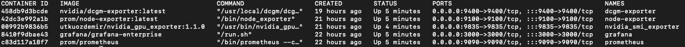
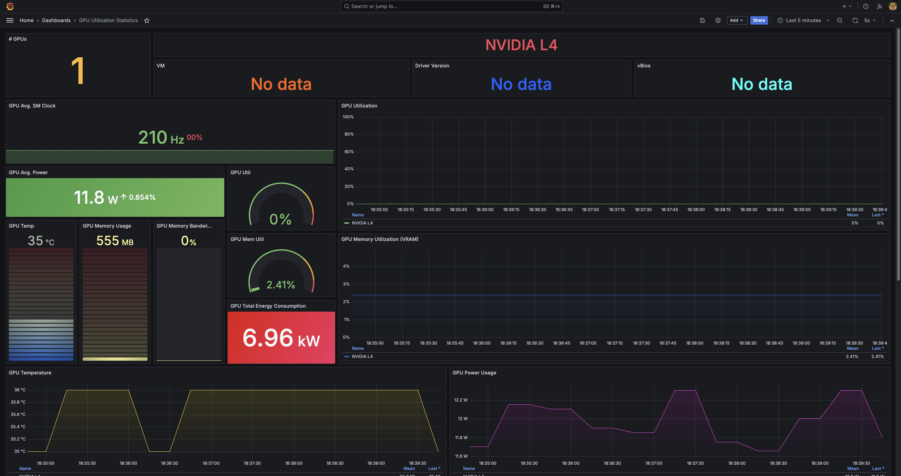

# Deep Learning Monitoring
 
## Introduction

This project is designed to provide comprehensive visualization of server utilization during deep learning model training. By leveraging this tool, users can gain real-time insights into the performance and resource usage of their virtual machines, including detailed GPU metrics. This system is highly versatile and can be deployed across a range of environments, including personal computers, dedicated servers, and large-scale datacenters.

### Key Features:

1. Real-Time Monitoring: Track and visualize every critical aspect of the virtual machine, including CPU, memory, disk I/O, and GPU utilization, in real-time.

2. Deep Learning Optimization: Specifically tailored for monitoring environments where deep learning models are being trained, offering precise insights into GPU performance, memory usage, and processing speed.

3. Scalable Deployment: The tool can be easily deployed on various platforms, from personal computers to enterprise-level datacenters, making it ideal for both individual developers and large teams.

4. Google Cloud Platform Integration: Utilizes Google Cloud Platform (GCP) to spin up and manage virtual machines, ensuring robust and scalable infrastructure for monitoring.

5. Comprehensive Toolset: Includes installation and configuration of essential monitoring tools like DCGM, Prometheus, and nvidia_smi_exporter to capture and display GPU metrics alongside other system metrics.

6. Customizable Dashboards: Offers customizable Grafana dashboards that allow users to filter and drill down into specific metrics, providing a tailored view based on individual needs.

7. Cross-Platform Compatibility: Compatible with various operating systems and environments, ensuring flexibility in deployment and usage.

### Applications:

This monitoring tool is ideal for:

1. Researchers and developers working on deep learning models who need to monitor and optimize resource usage.

2. IT administrators managing server infrastructure in datacenters or cloud environments.

3. Educational institutions and research labs requiring detailed insights into computational resource allocation.

### Deployment Scenarios:

1. Personal Computers: Developers can deploy the monitoring system on their local machines to track resource usage during model training.

2. Servers: IT teams can use this tool to manage and optimize server performance, ensuring efficient utilization of resources.

3. Datacenters: Large-scale deployments in datacenters can benefit from the system's scalability and detailed monitoring capabilities, helping to maintain high performance and resource efficiency.

By implementing this monitoring system, users can achieve greater transparency and control over their computational resources, ultimately leading to more efficient deep learning model training and better resource management.

## Setting Up

### Prerequisites & Tech-stacks

- Google Cloud Platform
- Debian Linux
- CUDA - 12.1
- Python
- Tensorflow
- PyTorch
- Docker
- Prometheus
- Grafana
- Node Exporter
- DCGM Exporter
- Nvidia SMI Exporter


All the above mentioned packages will be availabe under [prerequisites](#prerequisites--tech-stacks).

### Environment Setup

Assuming you’ve got your GCP account ready, here's a dynamic approach to get started. I’m spinning up a virtual machine with 4 cores and 16 GB of memory, powered by a Debian-based deep learning image. This image comes pre-loaded with PyTorch 2.3, CUDA 12.1, FastAI, and Python 3.10, ensuring you’re ready to dive into deep learning right out of the gate. I’ve chosen a robust 150 GB of storage, and I’m opening up the HTTP and HTTPS channels for smooth networking.

For the GPU, I’m going with the versatile L4, but feel free to mix it up with other options like A100s or H100s, depending on your project needs. The choice is yours to tailor your machine to perfection.


Once the VM is up and running, the next step is to SSH into it and set up authentication for seamless access from your personal desktop. The most efficient method is to use SSH keys. By transferring your SSH keys to the VM, you can enable passwordless login, streamlining the process and making it much easier to log in.

You could refer to this blog for setting up [passwordless ssh](https://www.redhat.com/sysadmin/passwordless-ssh)

With the server now up and running, it's time to move on to the essential installations. Let's get started on setting up the core components to power your project.

## Network Setup

## Tools Configurations

First, let’s get Docker installed, as it will be the foundation for running all the tools on this VM. You can follow the installation instructions provided in the link below to set up Docker:

[Docker Installation Guide](https://docs.docker.com/engine/install/debian/)

Next, let's install the prometheus exporter.

Prometheus is an open-source monitoring and alerting toolkit designed for reliability and scalability. It excels in gathering and storing time-series data, providing a powerful query language (PromQL) for data analysis and visualization. Prometheus collects metrics from configured endpoints at specified intervals, allowing for real-time monitoring and alerting based on these metrics.

### Key features of Prometheus include:

- Multi-dimensional Data Model: It stores data as time-series with a flexible metric model, enabling detailed querying and analysis.
- Powerful Query Language: PromQL allows for sophisticated queries and aggregations of metric data.
- Automatic Service Discovery: Prometheus can automatically discover services and scrape metrics from them.
- Visualization and Alerting: Integration with visualization tools like Grafana and built-in alerting capabilities help in creating actionable insights and notifications based on metrics.

Prometheus is widely used in cloud-native and microservices architectures due to its ease of use, scalability, and strong community support.

You can install it by follow the below command

```sh
docker run -d --name prometheus -p 9090:9090 prom/prometheus

```

This command will start Prometheus and expose it on port 9090.

Next, let's install the DCGM exporter. This tool will help you monitor GPU metrics effectively.

The NVIDIA Data Center GPU Manager (DCGM) is a suite of tools and services designed to monitor and manage NVIDIA GPUs in data centers. It provides insights into GPU health, performance, and utilization, helping to optimize and troubleshoot GPU resources. DCGM offers a comprehensive set of metrics and diagnostic capabilities, making it essential for managing GPU workloads effectively and ensuring high performance in data-intensive environments.

You can install it by follow the below command

```sh
docker run --gpus all -d --name dcgm-exporter -p 9400:9400 nvidia/dcgm-exporter

```

This command will start DCGM Exporter and expose it on port 9400.

Next, let's install the Node exporter. 

Node Exporter is a tool developed by Prometheus to collect and expose system metrics from Linux servers. It provides detailed insights into hardware and operating system performance, such as CPU usage, memory consumption, disk I/O, and network statistics. Node Exporter helps in monitoring system health and performance by exporting these metrics to Prometheus, where they can be visualized and analyzed. It is a crucial component for gaining a comprehensive view of your infrastructure's performance and ensuring efficient resource management.

You can install it by follow the below command

```sh
docker run -d --name node-exporter -p 9100:9100 prom/node-exporter

```

This command will start Node Exporter and expose it on port 9100.

Finally, let’s install Grafana to visualize the metrics collected by all the exporters. Grafana is a powerful open-source platform for monitoring and observability that integrates seamlessly with Prometheus to create interactive and informative dashboards.

You can install it by follow the below command

```sh
docker run -d --name grafana -p 3000:3000 grafana/grafana-enterprise

```

This command will start Grafana and expose it on port 3000.

Finally, if you type the below command and hit enter, you should be able to view the below output:

```sh
docker ps

```



## Exporter Integration to Prometheus


## Integrating the Prometheus to Grafana


 

## Conclusion

With this tool, you can effortlessly visualize your model's resource usage, helping you decide whether to scale up or down your VM configuration. Plus, it's a lot of fun to experiment with! I used it to discover that TensorFlow performs significantly faster than PyTorch in my image classification tests. I noticed that TensorFlow utilizes 98% of my L4 GPU during training, whereas PyTorch only taps into 6%. Fascinating, right? I’m diving into this discrepancy to uncover more.

Feel free to explore and see what you find out. If you’re a gamer like me, try connecting this tool to your Nvidia RTX GPU and see just how much your games are leveraging your hardware. Enjoy the insights and have fun visualizing your GPU usage! Cheers.
